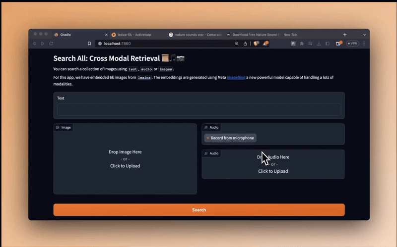

# Search All: Cross Modal Retrieval 📜🎵📷
You can search a collection of images using `text`, `images` or `audio`.

YouTube Video: https://www.youtube.com/watch?v=gGeUbwiljSE

> **Warning**
> The model is really bad with multi modalities, text is way heavier than the others, I've tried a couple of things but they didn't work - assuming I was not dumb, I wouldn't reccomand using this model for anything real 

For this app, we have embedded stable diffusion generated images from [`lexica`](ttps://lexica.art/n) eval set, you can now search them using **text, images or audio**. The embeddings are generated using Meta [ImageBind](https://imagebind.metademolab.com/) a new powerful model capable of handling a lots of modalities.



## Installation

### Python

You have the same installation requirements as the original [imagebind](https://github.com/facebookresearch/ImageBind) plus a couple of more packages. You can install them all by

```python
conda create --name imagebind python=3.8 -y
conda activate imagebind

pip install -r requirements.txt
```

Then you can run the app by

```python
gradio app.py
```

It should download the correct model, it might take a while.


### Docker

Be sure the have both [docker](https://docs.docker.com/engine/install/) and [nvidia-docker](https://docs.nvidia.com/datacenter/cloud-native/container-toolkit/latest/install-guide.html) installed. Build the container

```bash
docker build -t search-all .
```

Run it 

```bash
docker run --gpus all --rm -it --ipc=host  --ulimit memlock=-1 --ulimit stack=67108864 -v $PWD/.checkpoints:/workspace/.checkpoints -p 7860:7860 search-all
```

It should download the correct model, it might take a while.

Then, `http://localhost:7860`

## Seed the database

We use images from [`lexica`](https://lexica.art/) gently borrowed by this [hugging face dataset](https://huggingface.co/datasets/xfh/lexica_6k). You need to download them and edit `scripts/create_embeddings.py`. 

## Contributing

Thanks a lot for considering. The only requirements is that you run `make style` so all the code is nice and formatted :)

