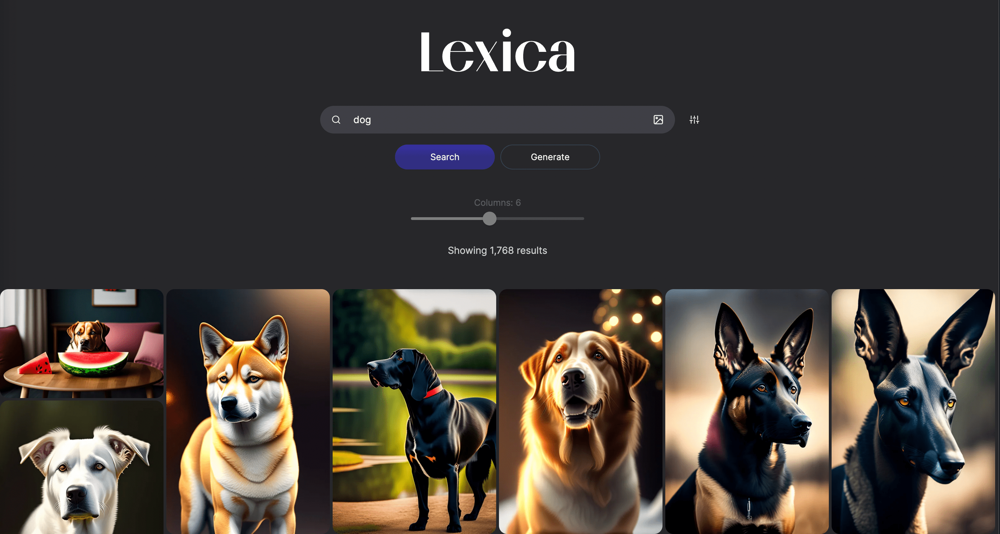
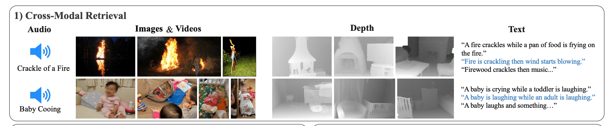
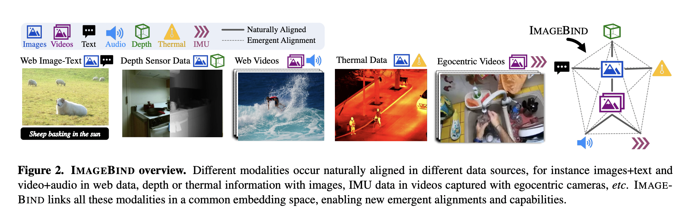
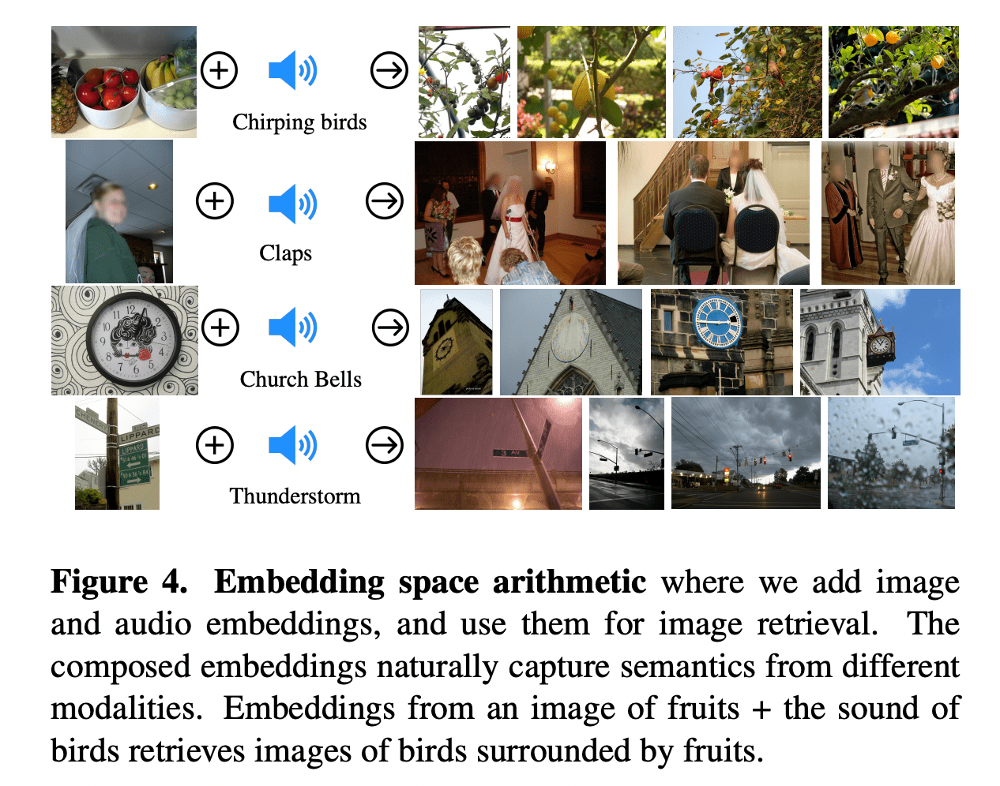
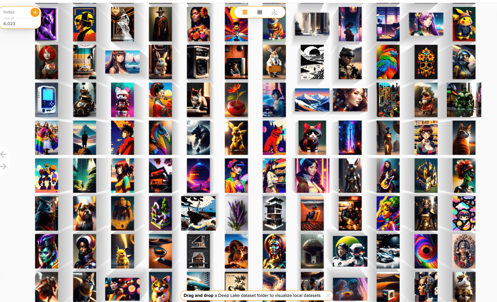
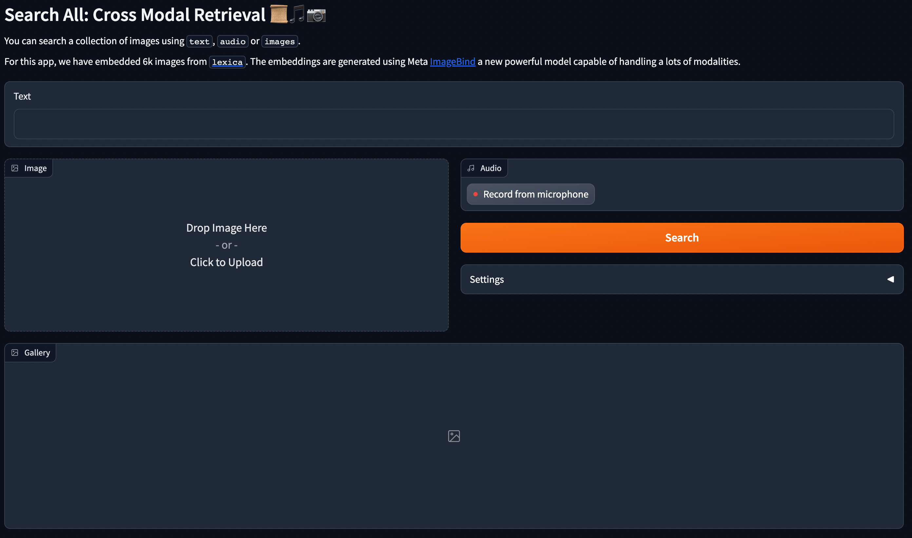
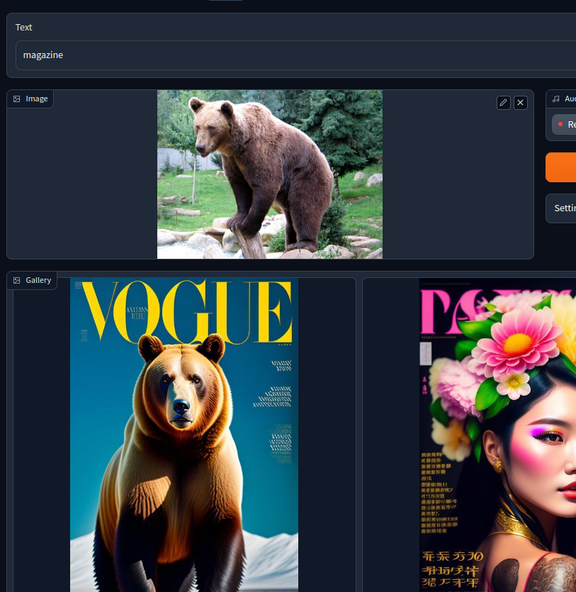
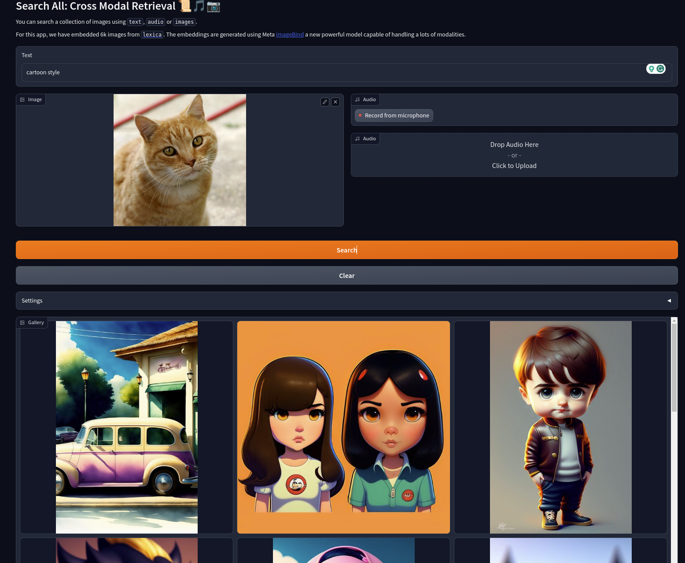

# Search All: Cross Multi Modal Retrieval with ImageBind and DeepLake 📜🎵📷

Hi There 👋 Hope everything is great! In this tutorial we will see how to create a search engine to retrieve AI generated images using **text**, **audio** or **images**.

TODO INSERT VIDEO

We will use [gradio](ttps://gradio.app/) to create the app, the new powerful multi modal model created by Meta: [ImageBind](https://imagebind.metademolab.com/) and [deeplake](https://www.deeplake.ai/) to store the embeddings.

A public demo is available here and code is on GitHub, feel free to test it out :) 

[TODO insert link to demo]()

Let's get started

## Plan of Attack

We need four things: data, a way to generate embeddings, a vector database to store them and a interactive app. Let's start with the data

## Getting Data

I was thinking about interesting data to search on, so I come across this [dataset hosted on hugging face](https://huggingface.co/datasets/xfh/lexica_6k) that contains images from [lexica](https://lexica.art/) a website where you can search for AI generate (mostly stable diffusion) images. To my knowledge, the search works by exact match in the prompt, while we will create a semantic search.



Since we want to display the images on the web app, we need to get them and store them somewhere (in our case in a s3 bucket). So, first we load the [hugging face dataset](https://huggingface.co/docs/datasets/index)

```python
# pip install datasets
from datasets import load_dataset

dataset = load_dataset("xfh/lexica_6k", split="train")
```

Then we store each image to disk

```python
for row in dataset:
    image = row["image"]
    name = row["text"]
    image.save(f"{row[name]}.jpg")
```

This is a simplified version, for speed we used a thread pool on dataset batches. Then we stored the images in a s3 bucket, so we can show them later on the app

## Create Embeddings

To search the images given a query, we need to encode the images in embeddings and then encode the query and perform cosine similarity to find the "closets", aka "most similar" images. We would like to search using multiple modalities, text, images or audio, for this reason, we decided to use the new Meta model called [ImageBind](https://imagebind.metademolab.com/).

### ImageBind

In a nutshell, ImageBind is a transformer-based model trained on multiple pairs of modalities, e.g. text-image, and learns how to map all of them in the same vector space. This means that a text query `"dog"` will be mapped close to a dog image, allowing us to seamlessly search in that space. The main advantage is that we don't need one model per modality, like in CLIP where you have one for text and one for image, but we can use the **same weights** for all of them. The following image taken from the paper shows the idea



The model supports images, text, audio, depth, thermal, and IMU data. We will limit ourselves to the first three. The task of learning similar embeddings for similar concepts in different modalities, e.g. "dog" and an image of a dog, is called *alignment*. The ImageBind Authors used a [Vision Transformer (ViT) ](https://arxiv.org/abs/2010.11929), a common architecture these days. Due to the number of different modalities, the preprocessing step is different. For example, for videos we need to take into account the time dimension, the audio needs to be converted to spectrogram, but the main weights are the same.



To learn to *align* pairs of modalities, (text, image), (audio, text), the Authors used *contrastive learning* and specifically the [*InfoNCE* loss](https://arxiv.org/abs/1807.03748). Using *InfoNCE*, the model is trained to identify a positive example from a batch of negative ones by maximizing the similarity between positive pairs and minimizing the similarity between negative ones.

The most interesting thing is that even if the model was trained on pairs (text, image) and (audio, text) the model learns also (image, audio). This is what the Authors called *"Emergent alignment of unseen pairs of modalities"*/

Moreover, we can do **Embedding space arithmetic**, where we add (or subtract) multiple modalities embeddings to capture different semantic information. We'll play with it later on



For the most curious reader, you can learn more by reading the [paper](https://arxiv.org/abs/2305.05665)

Okay, let's get the embeddings. We need to load the model and store the embeddings for all the images so we can later on read them and dump them in the vector db. 

Getting the embeddings is quite easy with the [ImageBind code](https://github.com/facebookresearch/ImageBind) code.

```python
import data
import torch
from models import imagebind_model
from models.imagebind_model import ModalityType

text_list=["A dog.", "A car", "A bird"]
image_paths=[".assets/dog_image.jpg", ".assets/car_image.jpg", ".assets/bird_image.jpg"]
audio_paths=[".assets/dog_audio.wav", ".assets/car_audio.wav", ".assets/bird_audio.wav"]

device = "cuda:0" if torch.cuda.is_available() else "cpu"

# Instantiate model
model = imagebind_model.imagebind_huge(pretrained=True)
model.eval()
model.to(device)

# Load data
inputs = {
    ModalityType.TEXT: data.load_and_transform_text(text_list, device),
    ModalityType.VISION: data.load_and_transform_vision_data(image_paths, device),
    ModalityType.AUDIO: data.load_and_transform_audio_data(audio_paths, device),
}

with torch.no_grad():
    embeddings = model(inputs)

print(embeddings[ModalityType.VISION])
print(embeddings[ModalityType.AUDIO])
print(embeddings[ModalityType.TEXT])
```

We first store all the images embeddings as `pth` files on disk using a simple function to batch the images. Note that we store a dictionary so we can add metadata; we are interested in the `image_path`, we will use it later.

```python
@torch.no_grad()
def encode_images(
    images_root: Path,
    model: torch.nn.Module,
    embeddings_out_dir: Path,
    batch_size: int = 64,
):
    # not the best way but the faster, best way would be to use a torch Dataset + Dataloader
    images = images_root.glob("*.jpeg")
    embeddings_out_dir.mkdir(exist_ok=True)
    for batch_idx, chunk in tqdm(enumerate(chunks(images, batch_size))):
        images_paths_str = [str(el) for el in chunk]
        images_embeddings = get_images_embeddings(model, images_paths_str)
        torch.save(
            [
                {"metadata": {"path": image_path}, "embedding": embedding}
                for image_path, embedding in zip(images_paths_str, images_embeddings)
            ],
            f"{str(embeddings_out_dir)}/{batch_idx}.pth",
        )
```

Note that a better solution would have been using [torch Dataset + Dataloader](https://pytorch.org/tutorials/recipes/recipes/loading_data_recipe.html). We were lazy here.

## Storing data into the Vector Database

After we have obtained our embeddings, is time to load them into deep lake vector db. You can learn more about deep lake on the [official code documentation](https://docs.deeplake.ai/en/latest/).

To start, we need to define the vector db

```python
import deeplake

ds = deeplake.empty(
            path="<hub://<YOUR_ACTIVELOOP_ORG_ID>/<DATASET_NAME>",
            runtime={"db_engine": True},
            token="<YOUR_TOKEN>",
            overwrite=overwrite,
        )
```

We are setting `db_engine=True`, meaning we won't store the data on our disk but we will use deep lake cloud to both store the data and run our queries.

Next, we need to define the shape of the data

```python
with ds:
    ds.create_tensor(
        "metadata",
        htype="json",
        create_id_tensor=False,
        create_sample_info_tensor=False,
        create_shape_tensor=False,
        chunk_compression="lz4",
    )
    ds.create_tensor("images", htype="image", sample_compression="jpg")
    ds.create_tensor(
        "embeddings",
        htype="embedding",
        dtype=np.float32,
        create_id_tensor=False,
        create_sample_info_tensor=False,
        max_chunk_size=64 * MB,
        create_shape_tensor=True,
    )
```

Here we create three tensors, one to hold the `metadata` of each embedding, one to store the `images` (in our case this is optional but it's cool to showcase) and one to store the actual tensors of our `embeddings`

Then it's time to add our data, if you recall we stored batched embeddings to disk as `.pth` files.

```python

def add_torch_embeddings(ds: deeplake.Dataset, embeddings_data_path: Path):
    embeddings_data = torch.load(embeddings_data_path)
    for embedding_data in embeddings_data:
        metadata = embedding_data["metadata"]
        embedding = embedding_data["embedding"].cpu().float().numpy()
        image = read_image(metadata["path"]).permute(1, 2, 0).numpy()
        metadata["path"] = Path(metadata["path"]).name
        ds.append({"embeddings": embedding, "metadata": metadata, "images": image})

embeddings_data_paths = embeddings_root.glob("*.pth")
list(
    tqdm(
        map(
            partial(add_torch_embeddings, ds),
            embeddings_data_paths,
        )
    )
)
```

Here we are just iterating all the embedings file and adding all the stuff within each one of them. We can have a look at the data from [activeloop dashboard](https:/app.activeloop.ai/zuppif/lexica-6k) - spoiler alert, it is quite cool 



Cool!

To run a query on deeplake we can

```python
embedding = # getting the embeddings from ImageBind
dataset_path = # our path to active loop dataset
limit = # number of results we want
query = f'select * from (select metadata, cosine_similarity(embeddings, ARRAY{embedding.tolist()}) as score from "{dataset_path}") order by score desc limit {limit}'
query_res = ds.query(query, runtime={"tensor_db": True})
# query_res = Dataset(path='hub://zuppif/lexica-6k', read_only=True, index=Index([(1331, 1551)]), tensors=['embeddings', 'images', 'metadata'])
```

We can access the metadata by

```python
query_res.metadata.data(aslist=True)["value"]
# [{'path': '5e3a7c9b-e890-4975-9342-4b6898fed2c6.jpeg'}, {'path': '7a961855-25af-4359-b869-5ae1cc8a4b95.jpeg'}]
```
If you remember, these are the metadata we stored previously, so the image filename. We wrapped all the vector store related code into a `VectorStore` class inside [vector_store.py](vector_store.py).

```python
class VectorStore():
    ...
        def retrieve(self, embedding: torch.Tensor, limit: int = 15) -> List[str]:
        query = f'select * from (select metadata, cosine_similarity(embeddings, ARRAY{embedding.tolist()}) as score from "{self.dataset_path}") order by score desc limit {limit}'
        query_res = self._ds.query(query, runtime={"tensor_db": True})
        images = [
            el["path"].split(".")[0]
            for el in query_res.metadata.data(aslist=True)["value"]
        ]
        return images, query_res
```

So, since the model supports text, images and audios we can also create an utility function to make our life easier

```python
@torch.no_grad()
def get_embeddings(
    model: torch.nn.Module,
    texts: Optional[List[str]],
    images: Optional[List[ImageLike]],
    audio: Optional[List[str]],
    dtype: torch.dtype = torch.float16
) -> Dict[str, torch.Tensor]:  
    inputs = {}
    if texts is not None:
        # they need to be ints
        inputs[ModalityType.TEXT] = load_and_transform_text(texts, device)
    if images is not None:
        inputs[ModalityType.VISION] = load_and_transform_vision_data(images, device, dtype)
    if audio is not None:
        inputs[ModalityType.AUDIO] = load_and_transform_audio_data(audio, device, dtype)
    embeddings = model(inputs)
    return embeddings
```

Always remember the `torch.no_grad` decorator :) Next, we can easility do


```python
vs = VectorStore(...)
vs.retrieve(get_embeddings(texts=["A Dog"]))
```

<table><tr><td>query</td><td>results</td></tr>
<tr><td>"A Dog"</td><td><image height="200px" src="https://activeloop-sandbox-fdd0.s3.amazonaws.com/8ed51ad3-f40a-46e6-ab07-5aceec549822"/>
</td><td>
<image height="200px" src="https://activeloop-sandbox-fdd0.s3.amazonaws.com/22146cb5-3085-4939-8229-2a2f20d8d980"/>
</td><td>
<image height="200px" src="https://activeloop-sandbox-fdd0.s3.amazonaws.com/4ef13128-ee3f-4802-b6be-51b2351e1288"/>
</td></tr></table>

```python
vs = VectorStore(...)
vs.retrieve(get_embeddings(images=["car.jpeg"]))
```

<table><tr><td>query</td><td>results</td></tr>
<tr><td><image height="200px"  src="images/car.jpeg" /></td><td><image height="200px" src="https://activeloop-sandbox-fdd0.s3.amazonaws.com/db0c1644-6407-4128-85a2-133cae307f80"/>
</td><td>
<image height="200px" src="https://activeloop-sandbox-fdd0.s3.amazonaws.com/ae2e7cba-ed40-4720-a78a-f8c4b3c7393a"/>
</td><td>
<image height="200px" src="https://activeloop-sandbox-fdd0.s3.amazonaws.com/259d09dd-e6b7-47e6-af5a-c206ea5d7b77"/>
</td></tr></table>

## Creating the app

We used gradio to create a nice ui for the app. It is actually quite simple, we need to first define the inputs and outputs of the app

```python
with gr.Blocks() as demo:
    # a little description
    with Path("docs/APP_README.md").open() as f:
        gr.Markdown(f.read())
    # text input
    text_query = gr.Text(label="Text")
    with gr.Row():
        # image input
        image_query = gr.Image(label="Image", type="pil")
        with gr.Column():
            # audio input
            audio_query = gr.Audio(label="Audio", source="microphone", type="filepath")
            search_button = gr.Button("Search", label="Search", variant="primary")
            # and a little section to change the settings
            with gr.Accordion("Settings", open=False):
                limit = gr.Slider(
                    minimum=1,
                    maximum=30,
                    value=15,
                    step=1,
                    label="search limit",
                    interactive=True,
                )
    # this will show the images
    gallery = gr.Gallery().style(columns=[3], object_fit="contain", height="auto")

```
This results in the following UI



Then we need to link the search button to the actual search code

```python
...
search_button.click(
        search_button_handler, [text_query, image_query, audio_query, limit], [gallery]
    )
```

This means, `text_query, image_query, audio_query, limit` are the inputs to `search_button_handler` and `gallery` is the output.

where `search_button_handler` is

```python
...
vs = VectorStore.from_env()
model = get_model()
...
def search_button_handler(
    text_query: Optional[str],
    image_query: Optional[Image.Image],
    audio_query: Optional[str],
    limit: int = 15,
):
    if not text_query and not image_query and not audio_query:
        logger.info("No inputs!")
        return
    # we have to pass a list for each query
    if text_query == "" and len(text_query) <= 0:
        text_query = None
    if text_query is not None:
        text_query = [text_query]
    if image_query is not None:
        image_query = [image_query]
    if audio_query is not None:
        audio_query = [audio_query]
    start = perf_counter()
    logger.info(f"Searching ...")
    embeddings = get_embeddings(model, text_query, image_query, audio_query).values()
    # if multiple inputs, we sum them
    embedding = torch.stack(list(embeddings), dim=0).sum(0).squeeze()
    logger.info(f"Model took {(perf_counter() - start) * 1000:.2f}")
    images_paths, query_res = vs.retrieve(embedding.cpu().float(), limit)
    return [f"{BUCKET_LINK}{image_path}" for image_path in images_paths]
```

So for each input we check that they exists, if they do we wrap them into a `list`. This is needed for our interal implementation. `vs.retrieve` is a function of `VectorStore`, just an utily class that wrap all the code in the same place. Inside that function we first compute the embeddings using the `get_embeddings` function showned before and then we run a query against the vector db. 

We have stored all the images into s3, so we return a list of links to the images there, this is the input to `gr.Gallery`

Where, that's it! Let's see in action. 

Normal single modality works as expected. 

If we receive more than one input, we sum them up. Basically,

```python
embedding = torch.vstack(list(embeddings)).sum(0)
```

For example, we can pass an image of a car and an audio of a f1 race.


or the text + image, we can also do text + image + audio, feel free to test it out!

 

Some of the results were not too great, "cartoon" + cat image




**In my experiments I've noticed that the text is stronger compared to image and audio when combinated with the other modalities** 

We encourage the reader to try to demo and share the results :)

Well that was it! 

Thanks a lot for reading, I hope you learnt something new. Let us know how well the demo works for you
