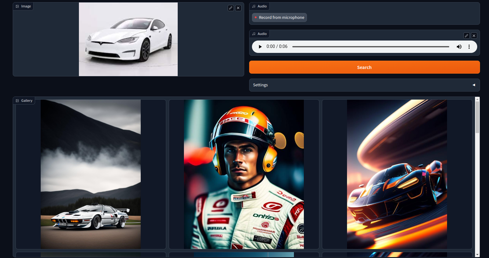

# Search All: Cross Modal Retrieval 📜🎵📷

In this tutorial we will see how to create search a AI generated images using **text**, **audio** or **images**.

TODO INSERT VIDEO

We will use [gradio](ttps://gradio.app/) to create the app, the new powerful multi modal model created by Meta: [ImageBind](https://imagebind.metademolab.com/) and [deeplake](https://www.deeplake.ai/) to store the embeddings.

A public demo is available here and code is on GitHub, feel free to test it out :)

## Plan of Attack

We need three things: data, a way to generate embeddings, a vector database to store them and a interactive app. Let's start with the data

## Getting Data

I was thinking about interesting data to search on, so I come accross this [dataset hosted on hugging face](https://huggingface.co/datasets/xfh/lexica_6k) that contains images from [lexica](https://lexica.art/) a website where you can search for ai generate (mostly stable diffusion) images. To my knowledge, the search works by exact match in the prompt, while we will create a semantic search.


To get the actual images from [hugging face datasets](https://huggingface.co/docs/datasets/index) we need to do a little processing. First we need to load the dataset

```python

from datasets import load_dataset

dataset = load_dataset("xfh/lexica_6k", split="train")
```

Then we need to store each image to disk

```python
for row in dataset:
    image = row["image"]
    name = row["text"]
    image.save(f"{row[name]}.jpg")
```

This is a simplified version, for speed we used a thread pool on dataset batches. Then we stored the images in a s3 bucket, so we can show them later on the app

## Create Embeddings

To be able to search, we need to encode the images in embeddings. Since we would like to use using multiple modalities, aka text, images or audio. We decided to use the new Meta model called [ImageBind](https://imagebind.metademolab.com/).

In a nutsheel, ImageBind is a transformer based model trained on multiple pairs of modalities, e.g. text-image, and learn how to map all of them in the same vector space. This means that a text query `"dog"` will be mapped close to a dog image, allowing us to seamlessly search in that space.The main advantage is that we don't need one model per modality, like in CLIP where you have one for text and one for image, but we can use the **same weights** for all of them. The following image taken from the paper shows the idea


The model supports images, text, audio, depth, thermal, and IMU data. We will limit ourself to the first three.

Moreover, we can do **Embedding space arithmetic**, where we add multiple modalities embeddings to capture different semantic information. 


For the most curious reader, you can learn more by reading the [paper](https://arxiv.org/abs/2305.05665)

Okay, let's get the embeddings. We need to load the model and store the embeddings for all the images. 

Getting the embeddings is quite easy with the [ImageBind code](https://github.com/facebookresearch/ImageBind)

```python
import data
import torch
from models import imagebind_model
from models.imagebind_model import ModalityType

text_list=["A dog.", "A car", "A bird"]
image_paths=[".assets/dog_image.jpg", ".assets/car_image.jpg", ".assets/bird_image.jpg"]
audio_paths=[".assets/dog_audio.wav", ".assets/car_audio.wav", ".assets/bird_audio.wav"]

device = "cuda:0" if torch.cuda.is_available() else "cpu"

# Instantiate model
model = imagebind_model.imagebind_huge(pretrained=True)
model.eval()
model.to(device)

# Load data
inputs = {
    ModalityType.TEXT: data.load_and_transform_text(text_list, device),
    ModalityType.VISION: data.load_and_transform_vision_data(image_paths, device),
    ModalityType.AUDIO: data.load_and_transform_audio_data(audio_paths, device),
}

with torch.no_grad():
    embeddings = model(inputs)

print(embeddings[ModalityType.VISION])
print(embeddings[ModalityType.AUDIO])
print(embeddings[ModalityType.TEXT])
```

We first store all the images embeddings as `pth` files on disk using a simple function to batch the images. Note that we store a dictionary so we can have some metadata; we are interested in the `image_path`, we will use it later.

```python
@torch.no_grad()
def encode_images(
    images_root: Path,
    model: torch.nn.Module,
    embeddings_out_dir: Path,
    batch_size: int = 64,
):
    # not the best way but the faster, best way would be to use a torch Dataset + Dataloader
    images = images_root.glob("*.jpeg")
    embeddings_out_dir.mkdir(exist_ok=True)
    for batch_idx, chunk in tqdm(enumerate(chunks(images, batch_size))):
        images_paths_str = [str(el) for el in chunk]
        images_embeddings = get_images_embeddings(model, images_paths_str)
        torch.save(
            [
                {"metadata": {"path": image_path}, "embedding": embedding}
                for image_path, embedding in zip(images_paths_str, images_embeddings)
            ],
            f"{str(embeddings_out_dir)}/{batch_idx}.pth",
        )
```

Note that a better solution would have been using [torch Dataset + Dataloader](https://pytorch.org/tutorials/recipes/recipes/loading_data_recipe.html).

## Storing data into the Vector Database

After we have obtained our embeddings, is time to load them into deep lake vector db. You can learn more about deep lake on the [official code documentation](https://docs.deeplake.ai/en/latest/).

To start, we need to define a vector db

```python
import deeplake

ds = deeplake.empty(
            path="<hub://<YOUR_ACTIVELOOP_ORG_ID>/<DATASET_NAME>",
            runtime={"db_engine": True},
            token="<YOUR_TOKEN>",
            overwrite=overwrite,
        )
```

We are setting `db_engine=True`, meaning we won't store the data on our disk but we will use deep lake cloud to both store the data and run our quries.

Then we need to define the shape of the data

```python
with ds:
    ds.create_tensor(
        "metadata",
        htype="json",
        create_id_tensor=False,
        create_sample_info_tensor=False,
        create_shape_tensor=False,
        chunk_compression="lz4",
    )
    ds.create_tensor("images", htype="image", sample_compression="jpg")
    ds.create_tensor(
        "embeddings",
        htype="embedding",
        dtype=np.float32,
        create_id_tensor=False,
        create_sample_info_tensor=False,
        max_chunk_size=64 * MB,
        create_shape_tensor=True,
    )
```

Here we create three tensors, one to hold the `metadata` of each embedding, one to store the images (in our case this is optional) and one to store the actual tensors of our embeddings

Then it's time to add our data, if you recall we store batched embeddings to disk as `.pth` files.

```python

def add_torch_embeddings(ds: deeplake.Dataset, embeddings_data_path: Path):
    embeddings_data = torch.load(embeddings_data_path)
    for embedding_data in embeddings_data:
        metadata = embedding_data["metadata"]
        embedding = embedding_data["embedding"].cpu().float().numpy()
        image = read_image(metadata["path"]).permute(1, 2, 0).numpy()
        metadata["path"] = Path(metadata["path"]).name
        ds.append({"embeddings": embedding, "metadata": metadata, "images": image})

embeddings_data_paths = embeddings_root.glob("*.pth")
list(
    tqdm(
        map(
            partial(add_torch_embeddings, ds),
            embeddings_data_paths,
        )
    )
)
```

Here we are just iterating all the embedings file and adding all the stuff within each one of them. We can have a look at the data from activeloop dashboard


Cool!

To run a query  with deeplake we can

```python
embedding = # getting the embeddings from ImageBind
dataset_path = # our path to active loop dataset
limit = # number of results we want
query = f'select * from (select metadata, cosine_similarity(embeddings, ARRAY{embedding.tolist()}) as score from "{dataset_path}") order by score desc limit {limit}'
query_res = ds.query(query, runtime={"tensor_db": True})
# query_res = Dataset(path='hub://zuppif/lexica-6k', read_only=True, index=Index([(1331, 1551)]), tensors=['embeddings', 'images', 'metadata'])
```

We can access the metadata by

```python
query_res.metadata.data(aslist=True)["value"]
# [{'path': '5e3a7c9b-e890-4975-9342-4b6898fed2c6.jpeg'}, {'path': '7a961855-25af-4359-b869-5ae1cc8a4b95.jpeg'}]
```
If you recall, this are the metadata we stored previously, so the image filename. We wrapped all the vector store related code into a `VectorStore` class inside [vector_store.py](vector_store.py).

```python
class VectorStore():
    ...
        def retrieve(self, embedding: torch.Tensor, limit: int = 15) -> List[str]:
        query = f'select * from (select metadata, cosine_similarity(embeddings, ARRAY{embedding.tolist()}) as score from "{self.dataset_path}") order by score desc limit {limit}'
        query_res = self._ds.query(query, runtime={"tensor_db": True})
        images = [
            el["path"].split(".")[0]
            for el in query_res.metadata.data(aslist=True)["value"]
        ]
        return images, query_res
```

Awesome, now we need to search! So, since the model supports text, images and audios we can also create an utility function to make our life easier


```python
@torch.no_grad()
def get_embeddings(
    model: torch.nn.Module,
    texts: Optional[List[str]],
    images: Optional[List[ImageLike]],
    audio: Optional[List[str]],
    dtype: torch.dtype = torch.float16
) -> Dict[str, torch.Tensor]:  
    inputs = {}
    if texts is not None:
        # they need to be ints
        inputs[ModalityType.TEXT] = load_and_transform_text(texts, device)
    if images is not None:
        inputs[ModalityType.VISION] = load_and_transform_vision_data(images, device, dtype)
    if audio is not None:
        inputs[ModalityType.AUDIO] = load_and_transform_audio_data(audio, device, dtype)
    embeddings = model(inputs)
    return embeddings
```

Always remember the `torch.no_grad` decorator :) Now we can


```python
vs = VectorStore(...)
vs.retrieve(get_embeddings(texts="A Dog"))
```

<table><tr><td>query</td><td>results</td></tr>
<tr><td>"A Dog"</td><td><image height="200px" src="https://activeloop-sandbox-fdd0.s3.amazonaws.com/8ed51ad3-f40a-46e6-ab07-5aceec549822"/>
</td><td>
<image height="200px" src="https://activeloop-sandbox-fdd0.s3.amazonaws.com/22146cb5-3085-4939-8229-2a2f20d8d980"/>
</td><td>
<image height="200px" src="https://activeloop-sandbox-fdd0.s3.amazonaws.com/4ef13128-ee3f-4802-b6be-51b2351e1288"/>
</td></tr></table>

```python
vs = VectorStore(...)
vs.retrieve(get_embeddings(images="car.jpeg"))
```

<table><tr><td>query</td><td>results</td></tr>
<tr><td><image height="200px"  src="images/car.jpeg" /></td><td><image height="200px" src="https://activeloop-sandbox-fdd0.s3.amazonaws.com/db0c1644-6407-4128-85a2-133cae307f80"/>
</td><td>
<image height="200px" src="https://activeloop-sandbox-fdd0.s3.amazonaws.com/ae2e7cba-ed40-4720-a78a-f8c4b3c7393a"/>
</td><td>
<image height="200px" src="https://activeloop-sandbox-fdd0.s3.amazonaws.com/259d09dd-e6b7-47e6-af5a-c206ea5d7b77"/>
</td></tr></table>

## Creating the app

We used gradio to create the nice ui for the app. It is actually quite simple, we need to first define the inputs and outputs of the app

```python
with gr.Blocks() as demo:
    # a little description
    with Path("docs/APP_README.md").open() as f:
        gr.Markdown(f.read())
    # text input
    text_query = gr.Text(label="Text")
    with gr.Row():
        # image input
        image_query = gr.Image(label="Image", type="pil")
        with gr.Column():
            # audio input
            audio_query = gr.Audio(label="Audio", source="microphone", type="filepath")
            search_button = gr.Button("Search", label="Search", variant="primary")
            # and a little section to change the settings
            with gr.Accordion("Settings", open=False):
                limit = gr.Slider(
                    minimum=1,
                    maximum=30,
                    value=15,
                    step=1,
                    label="search limit",
                    interactive=True,
                )
    # this will show the images
    gallery = gr.Gallery().style(columns=[3], object_fit="contain", height="auto")

```
This results in the following UI


Then we need to link the search button to the actual search code

```python
...
search_button.click(
        search_button_handler, [text_query, image_query, audio_query, limit], [gallery]
    )
```

This means, `text_query, image_query, audio_query, limit` are the inputs to `search_button_handler` and `gallery` is the output.

where `search_button_handler` is

```python
...
vs = VectorStore.from_env()
model = get_model()
...
def search_button_handler(
    text_query: Optional[str],
    image_query: Optional[Image.Image],
    audio_query: Optional[str],
    limit: int = 15,
):
    if not text_query and not image_query and not audio_query:
        logger.info("No inputs!")
        return
    # we have to pass a list for each query
    if text_query == "" and len(text_query) <= 0:
        text_query = None
    if text_query is not None:
        text_query = [text_query]
    if image_query is not None:
        image_query = [image_query]
    if audio_query is not None:
        audio_query = [audio_query]
    start = perf_counter()
    logger.info(f"Searching ...")
    embeddings = get_embeddings(model, text_query, image_query, audio_query).values()
    # if multiple inputs, we sum them
    embedding = torch.stack(list(embeddings), dim=0).sum(0).squeeze()
    logger.info(f"Model took {(perf_counter() - start) * 1000:.2f}")
    images_paths, query_res = vs.retrieve(embedding.cpu().float(), limit)
    return [f"{BUCKET_LINK}{image_path}" for image_path in images_paths]
```

So for each input we check that they exists, if they do we wrap them into a `list`. This is needed for our interal implementation. `vs.retrieve` is a function of `VectorStore`, just an utily class that wrap all the code in the same place. Inside that function we first compute the embeddings using the `get_embeddings` function showned before and then we run a query against the vector db. 

We have stored all the images into s3, so we return a list of links to the images there, this is the input to `gr.Gallery`

Where, that's it! Let's see in action. 

Normal single modality works as expected. 

If we receive more than one input, we sum them up. Basically,

```python
embedding = torch.stack(list(embeddings), dim=0).sum(0).squeeze()
```

For example, we can pass an image of a car and an audio of a f1 race.



or the text + image, we can also do text + image + audio, feel free to test it out!


Well that was it! 